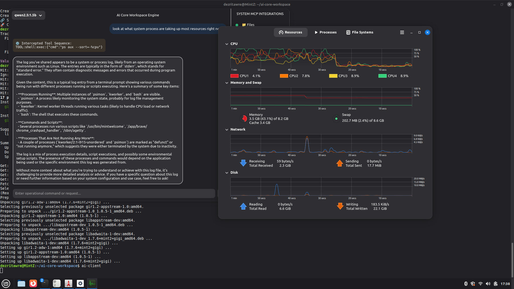
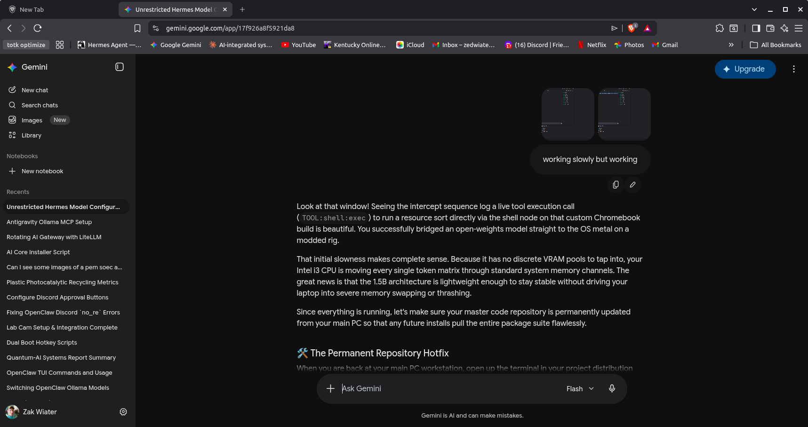
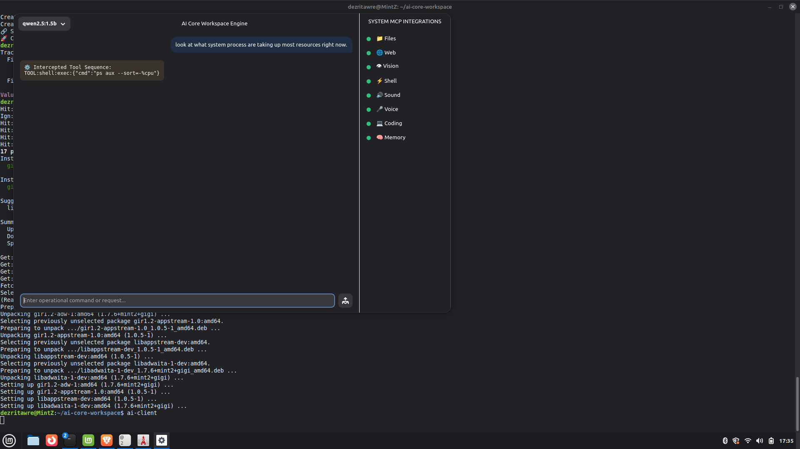

# ai-core-workspace

A GTK4 desktop client that plugs your local Ollama models directly into your system. Not a chat wrapper — it's an Intercept & Compute cycle that lets AI run commands, read files, and manage your machine through 8 micro-services running as background sockets.

Built because cloud APIs are expensive and local models are good enough. Runs completely offline.

---

## What It Does

You type something into the chat window. The model thinks. If it needs to do something — run a command, read a file, grab a camera frame — it emits a structured tool token. The client catches it, executes it safely, and feeds the result back into the conversation. Loop repeats up to 5 times, then the model gives you a final answer.

**Attach an image** and the client auto-routes through LLaVA 7B for vision analysis — no manual model switching needed.

No API keys. No internet required. Just Ollama on localhost:11434.

---

## The MCP Micro-Services

8 background services that listen on localhost sockets (ports 9101–9108). The client shows live red/green indicators for each one in a sidebar.

| Icon | Service | What It Does |
|------|---------|-------------|
| ⚡ | **Shell** (9104) | Runs system commands with 10s timeout safety |
| 📁 | **Files** (9101) | Reads and searches files up to 4000 chars |
| 🌐 | **Web** (9102) | Fetches URLs and checks connectivity |
| 👁 | **Vision** (9103) | Grabs frames from 9 RTSP cameras (Wyze Bridge on Pi) |
| 🔊 | **Sound** (9105) | Listens for wake word "Hey George", alarm/keyword detection |
| 🎤 | **Voice** (9106) | Speaks through speakers via edge-tts or espeak |
| 💻 | **Coding** (9107) | Code execution stub — ready for expansion |
| 🧠 | **Memory** (9108) | SQLite key-value store for persistent agent state |

The vision service connects to a Raspberry Pi running Wyze Bridge at 192.168.68.97:8554 and can grab frames from all 9 cameras. Sound service does continuous keyword spotting — smoke alarms, wake words, cooldown commands.

---

## Hardware Detection

The installer (`install.sh`) probes your system automatically:

- **RAM ≥16GB** → targets Qwen 3.5 8B model. Less → Qwen 3.5 1.5B
- **NVIDIA GPU** → CUDA config
- **AMD GPU** → ROCm/HSA config with `HSA_OVERRIDE_GFX_VERSION`
- **CPU-only** → optimized thread execution

Creates a systemd override at `/etc/systemd/system/ollama.service.d/override.conf` with your hardware-tuned parameters.

---

## Quick Start

```bash
git clone https://github.com/zedwiater/ai-core-workspace.git
cd ai-core-workspace
chmod +x install.sh
sudo ./install.sh
```

Or run the client directly:

```bash
python3 source/app/ai-client.py
```

For the MCP services:

```bash
# Start all 8 services
for f in source/mcp/mcp-*.py; do
    python3 "$f" &
done
```

---

## Screenshots

### Hardware Detection & Install


### Client Interface


### Tool Intercept Loop


---

## Project Layout

```
├── install.sh                  # Smart installer (RAM/GPU detection)
├── README.md                   # This file
├── source/
│   ├── app/
│   │   └── ai-client.py        # GTK4/Libadwaita client
│   └── mcp/
│       ├── mcp-shell.py        # Shell execution (port 9104)
│       ├── mcp-files.py        # File operations (port 9101)
│       ├── mcp-web.py          # Web fetcher (port 9102)
│       ├── mcp-vision.py       # Camera frame grabber (port 9103)
│       ├── mcp-sound.py        # Wake word + alarm detection (port 9105)
│       ├── mcp-voice.py        # Text-to-speech (port 9106)
│       ├── mcp-coding.py       # Code execution stub (port 9107)
│       └── mcp-memory.py       # SQLite state store (port 9108)
```

---

## Requirements

- Python 3.10+
- GTK4 + Libadwaita (for the GUI client)
- Ollama running on localhost:11434
- (Optional) ffmpeg for camera frame grabbing
- (Optional) whisper for sound keyword spotting

---

Built with $20 of OpenRouter credits and too many late nights. Because local AI should actually do things, not just chat.